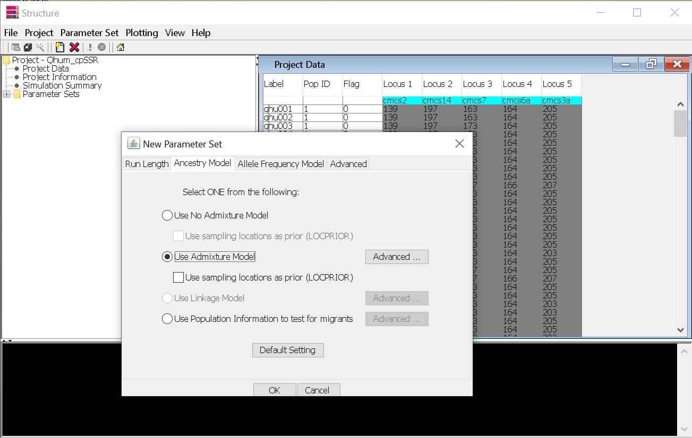
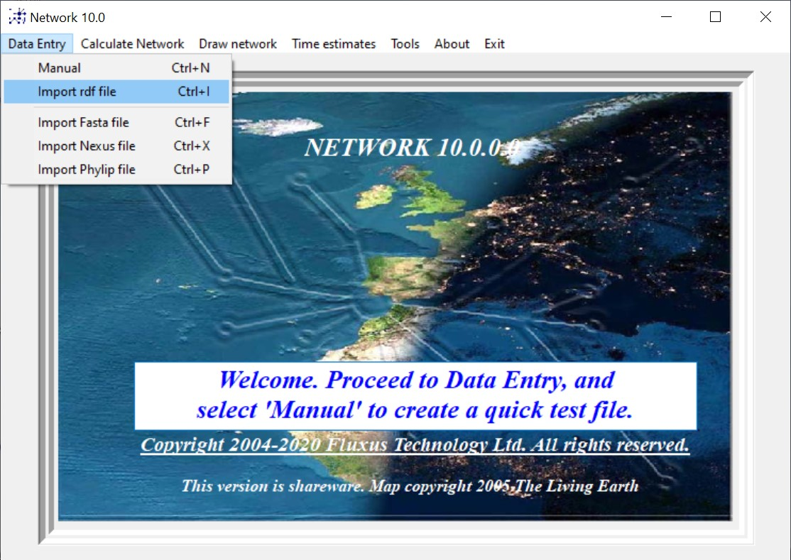

```{r setup, include=FALSE}
knitr::opts_chunk$set(echo = TRUE)
```


## Diversidad genética 

### Arlequin 


```{r input Arlequin, echo=FALSE}
cat(readLines('C:/Users/sofia/OneDrive/Escritorio/Moleculab2/archivos_entrada/arle_div.csv', n= 30), sep = '\n')

```

Partes del archivo de entrada de Arlequin:

1. Descripción de los datos (las más importantes se mencionan a continuación):
    
    a. Título del proyecto 
    b. Número de poblaciones
    c. Tipo de datos (haplotípicos o genotípicos)
    d. Tipo de datos (microsatélites, secuencias, etc)
    e. Caracter de separación entre loci
    f. Caracter para datos faltantes

2. Datos organizados por "población"
    
    a. Nombre de la población 
    b. Número de individuos 
    c. Datos:
      
      - La primera columna contiene la etiqueta de cada individuo
      - La segunda la frecuencia del genotipo 
      - Las columnas siguientes contienen los datos por cada locus

<p align="center">
  
</p>


<p align="center">
  
</p>

<p align="center">
  
</p>

<p align="center">
  
</p>

En la página 117 del manual de Arlequín viene una descripción de los diferentes índices obtenidos de la opción de índices de diversidad molecular:

*Standard diversity indices*
  
  1. **Gene diversity**
  2. **Expected heterozygosity per locus**
  3. **Number of usable loci**
  4. **Number of polymorphic sites (S)**
  5. **Allelic range (R)**
  6. **Garza-Williamson index (G-W)**
  
*Molecular indices*

  1. **Mean number of pairwise differences (π)**
  2. **Nucleotide diversity or average gene diversity over L loci**

[Descripciones del manual](pdf/Arlequin_diversidad.pdf) 

## Estructura genética 

### Arlequin

Una forma de evaluar la estructura genética es a través de un análisis de varianza molecular (AMOVA). El objetivo de este análisis es poner a prueba una hipótesis de estructra. Como resultado se obtiene el porcentaje de variación que hay dentro de las poblaciones, entre las poblaciones y entre grupos de poblaciones. 

[Excoffier, 1992](pdf/excoffier_1992.pdf) Artículo donde se describe el método.

<p align="center">
  
</p>

### STRUCTURE

Descripción general del manual de STRUCRURE:

*The program structure implements a model-based clustering method for inferring population structure using genotype data consisting of unlinked markers.  Applications of the method include demonstrating the presence of population structure, identifying distinct genetic populations, assigning individuals to populations, and identifying migrants and admixed individuals* 

*Briefly, we assume a model in which there are K populations (where K may be unknown), each of which is characterized by a set of allele frequencies at each locus. Individuals in the sample are assigned (probabilistically) to populations, or jointly to two or more populations if their genotypes indicate that they are admixed. It is assumed that within populations, the loci are at Hardy-Weinberg equilibrium, and linkage equilibrium. Loosely speaking, individuals are assigned to populations in such a way as to achieve this.*

```{r echo=FALSE}
cat(readLines('C:/Users/sofia/OneDrive/Escritorio/Moleculab2/archivos_entrada/cp_str.csv', n= 5), sep = '\n')
```

De manera general el archivo de entrada se compone de una matriz que almacena la información de los individuos en las filas y la información de los loci en las columnas. 

**Filas**: La primera fila tiene los nombres de los loci. El resto de las filas corresponde a los individuos. 

**Columnas**: La primera columna corresponde a la etiqueta que identifica cada individuo. La segunda los sitios de muestreo de donde vienen los individuos. La tercera sirve para indicar si se quieren usar los sitios de muestreo como estructura de la cual parte el análisis. 

Pasos para el análisis:

1. Abrir un nuevo proyecto y definir sus características. 

<p align="center">
  
</p>

<p align="center">
  
</p>

<p align="center">
  
</p>

<p align="center">
  
</p>

<p align="center">
  
</p>

<p align="center">
  
</p>

2. Definir parámetros del análisis. Dependiendo del objetivo y de los datos que se tengan se pueden escojer distintos parámetros. Algunas desiciones importantes: 

 - *Largo de la corrida*
  
  El objetivo de STRUCTURE es estimar el coeficiente de ancestría de cada individuo dados ciertos parámetros que nosotros damos al modelo: los genotipos, el número de grupos genéticos (K) y la distribución de las frecuencias alélicas en cada locus y en cada población. Esta última se obtiene de muestrear de manera independiente una cierta distribución. En teoría deberíamos poder encontrar una distribución de frecuencias tales que las poblaciones estén en equilibrio Hardy-Weinberg y en equilibrio de ligamiento. En general el cálculo de la probabilidad de los coeficientes de ancestría dados los parámetros no se puede resolver. Sin embargo, se puede estimar si exploramos diferentes opciones de los parámetros y calculamos su probabilidad. Por esta razón es que tenemos que asegurarnos de que la corrida es lo suficientemente larga como para que explore muchas opciones.
  
  Otro parámetro que tenemos que decidir además del largo total de la corrida es el largo del periodo de "descarte" (Burn in). Este periodo se refiere al número de cálculos que no vamos a utilizar antes de empezar a registrar los resultados. Se utiliza para descartar el posible efecto que la configuración inicial puede tener sobre el resultado final. 
  
  <p align="center">
  
</p>

<p align="center">
  
</p>
  
  - *Tipo de modelo de ancestría*:
    
    a. **Sin mezcla (no admixture):** En este modelo los individuos de asignan de manera discreta a una u otra población. Se parte de una probabilidad inicial para cada población es de 1/K. El resultado reporta la probabilidad posterior de que el individuo pertenenezca a la población a la que fue asignado.
    
    b. **Con mezcla (admixture):** Los individuos pueden tener ancestría mezclada. Se modela diciendo que el individuo "i" heredó una fracción de su genoma de ancestros de la población "k". 
    
<p align="center">
  
</p>

- *Modelos de frecuencias alélicas*
  
  a. **No correlacionadas:** Asume que las frecuencias alélicas en las poblaciones son independientes. 
  
  b. **Correlacionadas:** Supone que las frecuencias alélicas de distintas poblaciones serán muy similares (puede ser por migración o por ancestría compartida).

<p align="center">
  
</p>  
    
  - *Uso de información a priori*
    
    a. **LOCPRIOR models**: Usar los sitios de muestreo como información a priori para ayudar en el proceso de agrupamiento. Esta opción se puede considerar cuando la estructura es muy débil. 
    
    b. **USEPOPINFO model**: utiliza los sitios de muestreo para buscar migrantes o híbridos. También se puede usar para determinar a priori la ancestría de algunos individuos y ayudar en el proceso de agrupamiento. 
  
<p align="center">
  
</p>

3. Programar el número de repeticiones. 

<p align="center">
  
</p>

<p align="center">
  
</p>


<p align="center">
  
</p>
La típica forma gráfica de representar los resultados es una gráfica de barras. De lo general a lo particular, el número de colores en la gráfica corresponde al número de grupos genéticos (K) que nosotros indicamos. La gráfica está dividida por líneas negras que representan los sitios de muestreo. Por último, cada línea de color representa a un individuo, el o los colores que tiene asignados muestran la proporción de su genoma que proviene de cada grupo genético. 

<p align="center">
  
</p>

En el resúmen de todas las corridas que hicimos podemos ver la comparación de la probabilidad del genotipo dado el grupo genético. De manera informal se sugiere que el valor más chico es el que corresponde a la mejor elección de K. Sin embargo, esta es una desición que se debe hacer con cuidado y teniendo en cuenta el contexto biológico de lo que se esté analizando.

<p align="center">
  
</p>

Más información de cómo se usa Structure [Manual](pdf/Structure_man.pdf)

Artículo de descripción del método [Pritchard et al., 2000](pdf/structure_prichart.pdf)

## STRUCTURE HARVESTER

Un método más formal para seleccionar la k adecuada es el de Evanno y se puede calcular a través de la herramienta de (http://taylor0.biology.ucla.edu/structureHarvester/)

El primer paso es el de comprimir la carpeta de resultados de Structure (.zip).

<p align="center">
  
</p>

Posteriormente se carga en la página que calculará los resultados. 

<p align="center">
  
</p>

La idea de este método es que con el estadístico arrojado por structure Ln P(D) no es fácil reconocer qué K es la óptima. A través de una serie de derivadas se puede tener un mejor criterio de elección.

<p align="center">
  
</p>

[Evanno et al., 2005](pdf/Evanno.pdf) Artículo en el que se propone el método.

## SPAGeDi

El programa Spagedi lo vamos a utilizar para inferir si hay estructura filogeográfica, es decir, si hay una distribución no uniforme de los alelos en el espacio en la que además los alelos más similares se encuentren geográficamente juntos. Esto se hace comparando dos índices de diferenciación (Nst y Gst). 

$N_{ST}$ 

Se obtiene a partir de buscar la diferencia entre la diversidad total y la que está dentro de cada población, dividida por la diversidad total. 

$$\frac{v_{T}-v_{S}}{v_{T}}$$

$$N_{ST}=\frac{\sum_{i,j}\pi_{ij}C_{ij}}{v_{T}}$$

La diferencia entre $G_{ST}$ y $N_{ST}$ es que $N_{ST}$ toma en cuenta las diferencias entre los haplotipos ($\pi$), mientras que $G_{ST}$ solo toma en cuenta las frecuencias. 

<p align="center">
  
</p>

```{r spagedi, echo=FALSE, warning=FALSE, message=FALSE}
library(reader)
cat(readLines('C:/Users/sofia/OneDrive/Escritorio/Moleculab2/archivos_entrada/spagediPop.txt', n= 5), sep = '\n')

cat(n.readLines('C:/Users/sofia/OneDrive/Escritorio/Moleculab2/archivos_entrada/spagediPop.txt', n= 7, skip= 225), sep = '\n')

```

El archivo de entrada se compone de:

- un encabezado en el que se especifica el número de individuos, el número de poblaciones, número de coordenadas espaciales (columnas), numero de loci, número de dígitos por locus y ploidía.

- un número de intervalos de distancia

- encabezados de columnas (individuo, categoría, haplotipo)

- una lista con todos los individuos en la primera columna, el sitio de muestreo al que pertenecen y el haplotipo que tiene cada uno. El final de la lista se especifica con "END" 

- una matriz de distancias entre haplotipos.

<p align="center">
  
</p>

<p align="center">
  
</p>

<p align="center">
  
</p>

<p align="center">
  
</p>

<p align="center">
  
</p>

<p align="center">
  
</p>

<p align="center">
  
</p>

<p align="center">
  
</p>

<p align="center">
  
</p>

<p align="center">
  
</p>

<p align="center">
  
</p>

<p align="center">
  
</p>

## Network

Por último vamos a crear una red de haplotipos que va a calcular las relaciones entre los mismos. El archivo de entrada en este programa se puede hacer de manual o en formato .rdf 

<p align="center">
  
</p>

<p align="center">
  
</p>


<p align="center">
  
</p>

<p align="center">
  
</p>

<p align="center">
  
</p>

<p align="center">
  
</p>

<p align="center">
  
</p>

<p align="center">
  
</p>

<p align="center">
  
</p>

